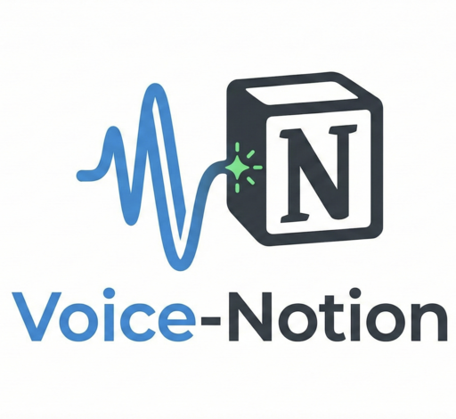

<div align="center">
  
</div>

# Voice-Notion 語音筆記助理

一個整合語音助理、FastAPI、Celery 與 Notion 的語音筆記自動化系統。

## 功能特點

- **語音輸入**: 透過 Siri 或其他語音助理錄音上傳
- **自動轉錄**: Faster-Whisper (CPU) 進行 STT
- **兩階段 AI**:
  - Stage 1: 路由判斷（操作類型、筆記類型、目標頁面）
  - Stage 2: 模板化摘要生成（meeting/idea/todo/general）
- **智慧整合**: Create 新頁面或 Append 到現有頁面
- **即時通知**: 完成後透過 Line 推播

## 技術架構

- **Backend**: FastAPI + Celery + Redis
- **STT**: Faster-Whisper (Small/CPU)
- **LLM**: Gemini Flash Lite（兩階段架構）
  - 路由判斷: Structured Output (temp=0.0)
  - 摘要生成: 模板驅動 (temp=1.0)
- **Notification**: Line Messaging API
- **Storage**: Notion API

## 快速開始

### 1. 安裝依賴

```bash
cd backend
poetry install
```

### 2. 設定環境變數

詳細設定步驟請參考 [docs/ENVIRONMENT_VARIABLES.md](docs/ENVIRONMENT_VARIABLES.md)

```bash
cp .env.example .env
# 編輯 .env 填入 API Keys
```

### 3. 啟動服務

```bash
docker-compose up --build
```

### 4. 測試 API

```bash
curl -X POST http://localhost:8000/api/v1/note \
  -F "audio=@test.m4a"
```

## 專案結構

```
backend/
├── app/
│   ├── main.py           # FastAPI 入口
│   ├── config.py         # 環境變數
│   ├── core/             # 核心模組
│   ├── prompts/          # LLM Prompts & Templates ✨
│   │   ├── routing.py    # 路由判斷 prompt
│   │   └── templates/    # meeting/idea/todo/general (詳見 [docs/PROMPT_TEMPLATES.md](docs/PROMPT_TEMPLATES.md))
│   ├── routes/           # API 路由
│   ├── schemas/          # Pydantic Schema
│   ├── services/         # 業務邏輯
│   └── worker/           # Celery Tasks
├── Dockerfile.web        # Web 容器
├── Dockerfile.worker     # Worker 容器
└── pyproject.toml
```

## 開發說明

- Web Container: 輕量，不包含 faster-whisper
- Worker Container: 包含 STT 模型與 ffmpeg
- 共用 codebase，透過不同 Dockerfile 達成分離

## License

- 待補
