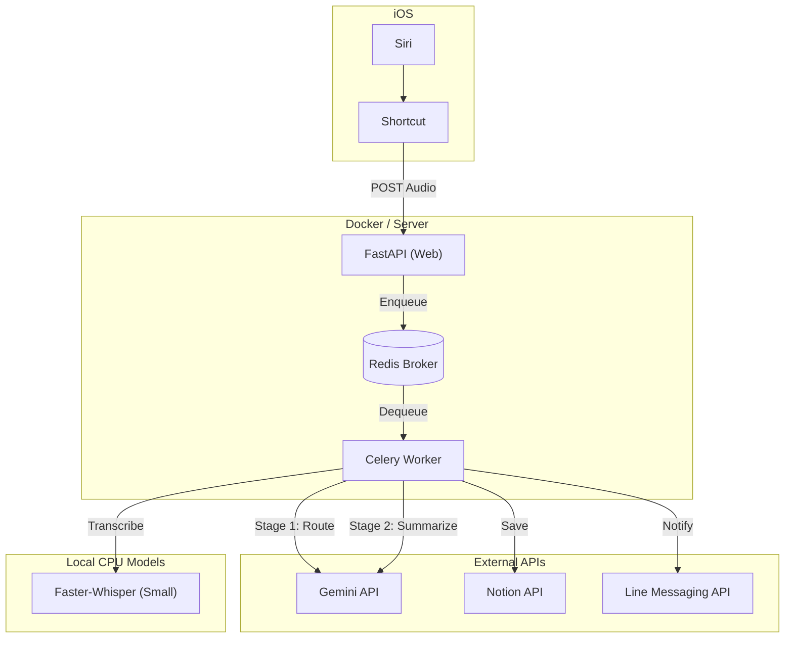

# 專案需求書：Voice-Notion 語音筆記助理

## 1. 專案概述 (Project Overview)
**目標**：建立一個自動化語音筆記系統，讓使用者能透過 Siri 語音指令（喚醒詞：Voice-Notion）啟動，直接口述想法或待辦事項。系統將自動進行語音轉文字 (STT)、AI 重點摘要，並將結構化內容存入 Notion 指定頁面，最後透過 Line 主動通知使用者「已存取摘要」。

**核心價值**：
- **Hands-free**：完全語音操作，適合駕駛、行進間使用。
- **Automated Intelligence**：自動摘要與結構化，省去整理筆記的時間。
- **Async Reliability**：採用 Celery 佇列機制，確保任務不因連線中斷或資源啟動而遺失。

## 2. 專案技術棧 (Tech Stack)

| 領域 | 技術選型 | 說明 |
| :--- | :--- | :--- |
| **Client / Trigger** | **iOS Shortcuts (捷徑)** | 前端介面。負責錄音並上傳至 Server (Fire-and-Forget)。 |
| **Backend API** | **FastAPI + Celery** | 核心架構。使用 **Poetry** 進行套件管理。 |
| **Task Queue** | **Redis** | 確保任務非同步執行與重試。 |
| **Speech-to-Text (STT)** | **Faster-Whisper (Small)** | 運行於 CPU 背景執行 (MVP)，無需 Kaggle/GPU。 |
| **AI Summary** | **Gemini Flash Lite (兩階段)** | Stage 1: 路由判斷 (Structured Output)。Stage 2: 依模板生成摘要。 |
| **Notification** | **Line Messaging API** | 主動推播結果給使用者。 |
| **Database** | **Notion API** | 儲存筆記內容。 |
| **Parser** | **markdown-it-py** | 解析 Markdown 並轉換為 Notion Block 格式。 |

## 3. 專案用戶流程圖 (User Flow)

```mermaid
sequenceDiagram
    participant User as 使用者
    participant Siri as iOS Siri / Shortcuts
    participant Server as Backend Server
    participant Redis as Redis Queue
    participant Worker as Celery Worker
    participant AI as AI Services
    participant Notion as Notion
    participant Line as Line Messaging

    User->>Siri: "Hey Siri, Siri-Notion"
    Siri->>User: "請說"
    User->>Siri: [口述語音]
    Siri->>Server: POST /voice-note (Audio File)
    Server->>Redis: Enqueue Task
    Server-->>Siri: 202 Accepted "已收到，處理中"
    Siri->>User: "已收到，處理中" (對話結束)

    Note right of User: 使用者可放下手機，後端持續運行

    loop Background Process
        Worker->>Redis: Pop Task
        Worker->>AI: STT (Faster-Whisper CPU)
        AI-->>Worker: Transcript
        Worker->>AI: LLM Stage 1 (Gemini) - Routing
        AI-->>Worker: action, title, template_type, target_page_id
        Worker->>AI: LLM Stage 2 (Gemini) - Summarize with Template
        AI-->>Worker: Structured Summary
        Worker->>Notion: Create / Append to Target Page
        Worker->>Line: Push Notification (Summary + Link)
        Line->>User: 🔔 "您的筆記已建立！點擊查看..."
    end
```

## 4. 專案技術框架 (Tech Architecture)

## 5. 實作細節概述 (Implementation Details)

### 5.1 iOS Shortcut
- **功能**：錄製音訊 -> Base64 編碼 -> POST 到 API。
- **特點**：不等待處理結果，只要收到 Server 回傳 `202` 即視為成功。

### 5.2 Backend (FastAPI + Celery)
- **Framework**: FastAPI, Celery, Redis.
- **Package Manager**: **Poetry**.
- **Worker**:
    - **STT**: 使用 `faster-whisper` (model=`small`) 於本機 CPU 執行，不依賴外部 Whisper API。
    - **LLM**: 使用 `google-genai` SDK 整合 Gemini。

### 5.3 兩階段 LLM 架構

#### Stage 1: 路由判斷 (Routing)
- **目的**: 判斷操作類型、筆記類型與目標頁面
- **輸出** (Structured Output):
    - `action`: `create` (建立新頁面) 或 `append` (追加到現有頁面)
    - `title`: 筆記標題
    - `template_type`: `meeting` / `idea` / `todo` / `general`
    - `target_page_id`: Notion 頁面 ID
- **溫度設定**: `temperature=0.0`（確保路由判斷一致性）

#### Stage 2: 模板化摘要生成 (Summarization)
- **目的**: 依據 template_type 載入對應模板，生成結構化摘要
- **模板系統** (`app/prompts/templates/`):
    - `meeting.md`: 會議紀錄（參與者、決議、待辦）
    - `idea.md`: 靈感記錄（主題、描述、要點）
    - `todo.md`: 待辦事項（任務清單、優先級）
    - `general.md`: 通用筆記（摘要、重點整理）
- **摘要規範**: 所有模板包含「繁體中文為主、清晰易讀、避免冗言、校稿防錯」
- **溫度設定**: `temperature=1.0`（鼓勵摘要多樣性）

### 5.4 Smart Notion Integration

#### Create vs Append
- **Create**: 建立新子頁面（全新主題）
- **Append**: 追加到現有頁面（相關主題）
    - 以 Divider 區隔
    - 標題含時間戳記：`📝 {title} (YYYY-MM-DD HH:MM)`
    - 自動處理長文字分割（Notion 2000 字元限制）

> [!NOTE]
> **Notion API 權限與頁面取得方式**:
> - 使用 `POST /v1/search` Endpoint 可取得 Integration 可存取的所有 Page/Database。
> - Notion 權限為「白名單」制：使用者須手動在 Notion 頁面上「Add connections」選擇 Bot，API 才能存取該頁面。
> - 系統啟動時將快取可用頁面清單，並提供給 Gemini 進行路由判斷。

#### 5.5 主要 API Service 方法
- **NotionService**:
    - `sync_available_pages()`: 取得 Integration 可存取的所有頁面與屬性，作為路由判斷依據。
    - `append_to_page(page_id, content)`: 將 Markdown 內容轉換為 Notion Blocks 並追加至指定頁面。
    - `create_page(title, content)`: 建立全新的頁面並寫入內容。
- **LLMService**:
    - `generate_routing(transcript, available_pages)`: 根據語音轉錄與可用頁面，判斷最佳操作 (Stage 1)。
    - `generate_summary(transcript, template_type, ...)`: 載入指定模板並生成結構化摘要 (Stage 2)。

## 6. 待討論與風險清單 (Discussion & Risks)

### 6.1 CPU Performance
- **Faster-Whisper (Small)** 在普通 CPU 上轉錄 1 分鐘音訊約需 10-30 秒，對於背景任務是完全可接受的。
- 需注意 Docker Container 的記憶體限制，避免 OOM。

### 6.2 網路穿透
- 開發階段使用 Ngrok 將 Localhost 的 fastapi port 暴露出去給 Siri 與 Line Webhook 呼叫。
