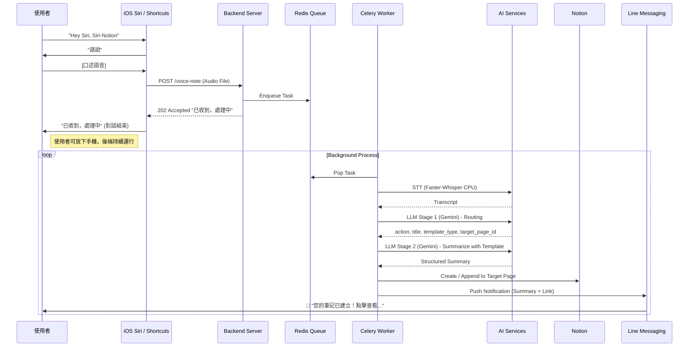
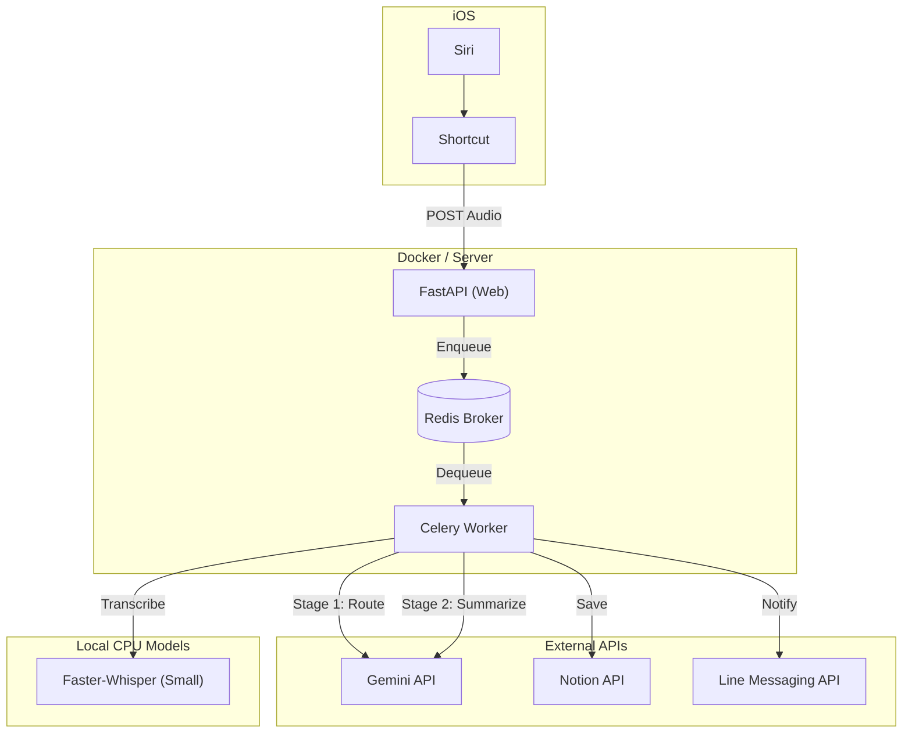

# 專案需求書：Voice-Notion 語音筆記助理

## 1. 專案概述 (Project Overview)
**目標**：建立一個自動化語音筆記系統，讓使用者能透過 Siri 語音指令（喚醒詞：Voice-Notion）啟動，直接口述想法或待辦事項。系統將自動進行語音轉文字 (STT)、AI 重點摘要，並將結構化內容存入 Notion 指定頁面，最後透過 Line 主動通知使用者「已存取摘要」。

**核心價值**：
- **Hands-free**：完全語音操作，適合駕駛、行進間使用。
- **Automated Intelligence**：自動摘要與結構化，省去整理筆記的時間。
- **Async Reliability**：採用 Celery 佇列機制，確保任務不因連線中斷或資源啟動而遺失。

## 2. 專案技術棧 (Tech Stack)

| 領域 | 技術選型 | 說明 |
| :--- | :--- | :--- |
| **Client / Trigger** | **iOS Shortcuts (捷徑)** | 前端介面。負責錄音並上傳至 Server (Fire-and-Forget)。 |
| **Backend API** | **FastAPI + Celery** | 核心架構。使用 **Poetry** 進行套件管理。 |
| **Task Queue** | **Redis** | 確保任務非同步執行與重試。 |
| **Speech-to-Text (STT)** | **Faster-Whisper (Small)** | 運行於 CPU 背景執行 (MVP)，無需 Kaggle/GPU。 |
| **AI Summary** | **Gemini Flash Lite (兩階段)** | Stage 1: 路由判斷 (Structured Output)。Stage 2: 依模板生成摘要。 |
| **Notification** | **Line Messaging API** | 主動推播結果給使用者。 |
| **Database** | **Notion API** | 儲存筆記內容。 |

## 3. 專案用戶流程圖 (User Flow)

## 4. 專案技術框架 (Tech Architecture)

## 5. 實作細節概述 (Implementation Details)

### 5.1 iOS Shortcut
- **功能**：錄製音訊 -> Base64 編碼 -> POST 到 API。
- **特點**：不等待處理結果，只要收到 Server 回傳 `202` 即視為成功。

### 5.2 Backend (FastAPI + Celery)
- **Framework**: FastAPI, Celery, Redis.
- **Package Manager**: **Poetry**.
- **Worker**:
    - **STT**: 使用 `faster-whisper` (model=`small`) 於本機 CPU 執行，不依賴外部 Whisper API。
    - **LLM**: 使用 `google-genai` SDK 整合 Gemini。

### 5.3 兩階段 LLM 架構

#### Stage 1: 路由判斷 (Routing)
- **目的**: 判斷操作類型、筆記類型與目標頁面
- **輸出** (Structured Output):
    - `action`: `create` (建立新頁面) 或 `append` (追加到現有頁面)
    - `title`: 筆記標題
    - `template_type`: `meeting` / `idea` / `todo` / `general`
    - `target_page_id`: Notion 頁面 ID
- **溫度設定**: `temperature=0.0`（確保路由判斷一致性）

#### Stage 2: 模板化摘要生成 (Summarization)
- **目的**: 依據 template_type 載入對應模板，生成結構化摘要
- **模板系統** (`app/prompts/templates/`):
    - `meeting.md`: 會議紀錄（參與者、決議、待辦）
    - `idea.md`: 靈感記錄（主題、描述、要點）
    - `todo.md`: 待辦事項（任務清單、優先級）
    - `general.md`: 通用筆記（摘要、重點整理）
- **摘要規範**: 所有模板包含「繁體中文為主、清晰易讀、避免冗言、校稿防錯」
- **溫度設定**: `temperature=1.0`（鼓勵摘要多樣性）

### 5.4 Smart Notion Integration

#### Create vs Append
- **Create**: 建立新子頁面（全新主題）
- **Append**: 追加到現有頁面（相關主題）
    - 以 Divider 區隔
    - 標題含時間戳記：`📝 {title} (YYYY-MM-DD HH:MM)`
    - 自動處理長文字分割（Notion 2000 字元限制）

> [!NOTE]
> **Notion API 權限與頁面取得方式**:
> - 使用 `POST /v1/search` Endpoint 可取得 Integration 可存取的所有 Page/Database。
> - Notion 權限為「白名單」制：使用者須手動在 Notion 頁面上「Add connections」選擇 Bot，API 才能存取該頁面。
> - 系統啟動時將快取可用頁面清單，並提供給 Gemini 進行路由判斷。

## 6. 待討論與風險清單 (Discussion & Risks)

### 6.1 CPU Performance
- **Faster-Whisper (Small)** 在普通 CPU 上轉錄 1 分鐘音訊約需 10-30 秒，對於背景任務是完全可接受的。
- 需注意 Docker Container 的記憶體限制，避免 OOM。

### 6.2 網路穿透
- 開發階段使用 Ngrok 將 Localhost 的 fastapi port 暴露出去給 Siri 與 Line Webhook 呼叫。
